# Нестеров Дмитрий ЛА-2 Лабораторная №1

# Задание 1

## Задача 1

### Текст задачи

**Сумма знаков.**

Дана сигнатура функции: `int sumLastNums (int x);`

Необходимо реализовать функцию таким образом, чтобы она возвращала результат сложения двух последних знаков числах, предполагая, что знаков в числе не менее двух. Подсказки:

```
int x=123%10; // х будет иметь значение 3
int у=123/10; // у будет иметь значение 12
```

Пример:

```
x=4568
результат: 14
```

### Алгоритм решения

Берём число без знака. Остаток от деления на десять даёт последнюю цифру. Делим число нацело на десять и снова берём остаток от деления на десять, это предпоследняя цифра. Складываем две цифры.

### Тестирование

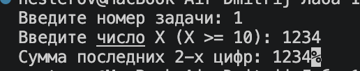

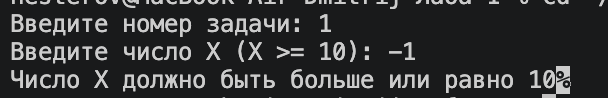

## Задача 2

### Текст задачи

**Есть ли позитив.**

Дана сигнатура функции: `bool isPositive (int x);`

Необходимо реализовать функцию таким образом, чтобы она принимала число x и возвращала true, если оно положительное.

Пример 1:

```
x=3
результат: true
```

Пример 2:

```
x=-5
результат: false
```

### Алгоритм решения

Сравниваем число с нулём. Если оно больше нуля, ответ «истина», иначе «ложь».

### Тестирование

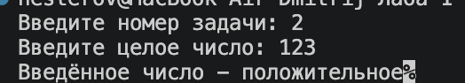

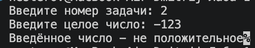

## Задача 3

### Текст задачи

**Большая буква.**

Дана сигнатура функции: `bool isUpperCase (char x);`

Необходимо реализовать функцию таким образом, чтобы она принимала символ x и возвращала true, если это большая буква в диапазоне от ‘A’ до ‘Z’.

Пример 1:

```
x=’D’
результат: true
```

Пример 2:

```
x=’q’
результат: false
```

### Алгоритм решения

Проверяем, что символ находится между первой и последней заглавными латинскими буквами алфавита включительно. Если да, ответ «истина», иначе «ложь».

### Тестирование

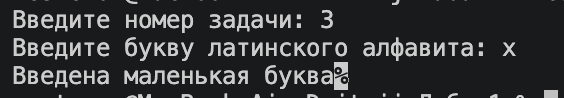

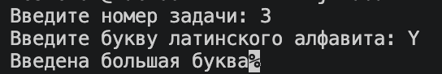

## Задача 4

### Текст задачи

**Делитель.**

Дана сигнатура функции: `bool isDivisor (int a, int b);`

Необходимо реализовать функцию таким образом, чтобы она возвращала true, если любое из принятых чисел делит другое нацело.

Пример 1:

```
a=3 b=6
результат: true
```

Пример 2:

```
a=2 b=15
результат: false
```

### Алгоритм решения

Если одно из чисел равно нулю, ответ «ложь». Иначе проверяем, делится ли первое число на второе без остатка или второе на первое. Если выполняется хотя бы одно, ответ «истина».

### Тестирование

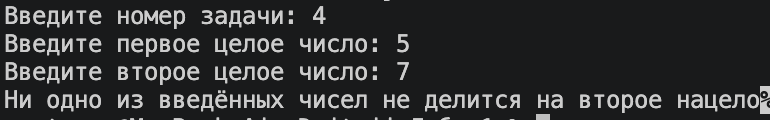

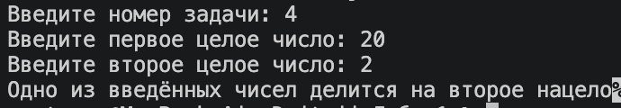

## Задача 5

### Текст задачи

**Многократный вызов.**

Дана сигнатура функции: `int lastNumSum(int a, int b)`

Необходимо реализовать функцию таким образом, чтобы она считала сумму цифр двух чисел из разряда единиц. Выполните с его помощью последовательное сложение пяти чисел и результат выведите на экран. Постарайтесь выполнить задачу, используя минимально возможное количество вспомогательных переменных.

Пример:

```
5+11 это 6
6+123 это 9
9+14 это 13
13+1 это 4
Итого 4
```

### Алгоритм решения

Вводим первое число, оно становится текущим результатом. Дальше четыре раза повторяем: вводим следующее число, складываем последнюю цифру результата с последней цифрой нового числа и выводим строку действия. Новое значение записываем вместо старого результата. В конце выводим итог.

### Тестирование

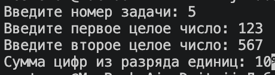

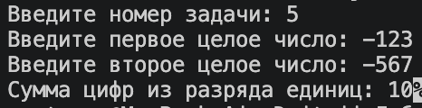


# Задание 2

## Задача 1

### Текст задачи

**Безопасное деление.**

Дана сигнатура функции: `double safeDiv (int x, int y);`

Необходимо реализовать функцию таким образом, чтобы она возвращала деление x на y, и при этом гарантировала, что не будет выкинута ошибка деления на 0. При делении на 0 следует вернуть из функции число 0. Подсказка: смотри ограничения на операции типов данных.

Пример 1:

```
x=5 y=0
результат: 0
```

Пример 2:

```
x=8 y=2
результат: 4
```

### Алгоритм решения

Если делитель равен нулю, возвращаем нуль. Иначе превращаем делимое в вещественное число и делим, чтобы дробная часть не потерялась.

### Тестирование

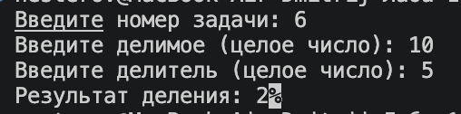

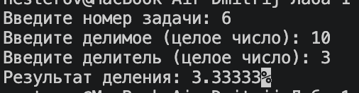

## Задача 2

### Текст задачи

**Строка сравнения.**

Дана сигнатура функции: `String makeDecision (int x, int y);`

Необходимо реализовать функцию таким образом, чтобы она возвращала строку, которая включает два принятых функцией числа и корректно выставленный знак операции сравнения (больше, меньше, или равно).

Пример 1:

```
x=5 y=7
результат: “5< 7”
```

Пример 2:

```
x=8 y=-1
результат: “8 >-1”
```

Пример 3:

```
x=4 y=4
результат: “4==4”
```

### Алгоритм решения

Если первое число меньше второго, выбираем знак «меньше». Если больше, выбираем знак «больше». Иначе выбираем знак «равно». Склеиваем в строку первое число, знак и второе число.

### Тестирование

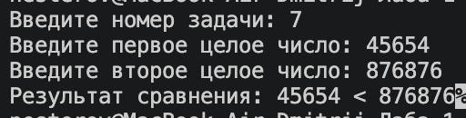

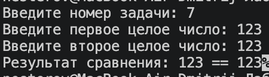

## Задача 3

### Текст задачи

**Тройная сумма.**

Дана сигнатура функции: `bool sum3 (int x, int y, int z);`

Необходимо реализовать функцию таким образом, чтобы она возвращала true, если два любых числа (из трех принятых) можно сложить так, чтобы получить третье.

Пример 1:

```
x=5 y=7 z=2
результат: true
```

Пример 2:

```
x=8 y=-1 z=4
результат: false
```

### Алгоритм решения

Проверяем три равенства: первое плюс второе равно третьему, первое плюс третье равно второму, второе плюс третье равно первому. Если верно хотя бы одно, ответ «истина».

### Тестирование

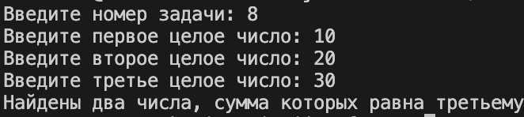

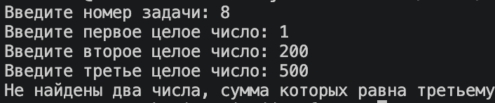

## Задача 4

### Текст задачи

**Возраст.**

Дана сигнатура функции: `String age (int x);`

Необходимо реализовать функцию таким образом, чтобы она возвращала строку, в которой сначала будет число х, а затем одно из слов:

- год
- года
- лет

Слово “год” добавляется, если число х заканчивается на 1, кроме числа 11.

Слово “года” добавляется, если число х заканчивается на 2, 3 или 4, кроме чисел 12, 13, 14.

Слово “лет” добавляется во всех остальных случаях.

Подсказка: оператор % позволяет получить остаток от деления.

Пример 1:

```
x=5
результат: “5 лет”
```

Пример 2:

```
x=31
результат: “31 год”
```

Пример 3:

```
x=44
результат: “44 года”
```

### Алгоритм решения

Находим остаток от деления на сто. Если он от 11 до 14, добавляем слово «лет». Иначе смотрим на остаток от деления на десять: если он равен 1, добавляем «год»; если от 2 до 4, добавляем «года»; во всех остальных случаях добавляем «лет». Слово записываем после числа.

### Тестирование

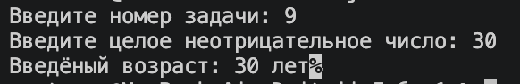

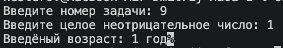

## Задача 5

### Текст задачи

**Вывод дней недели.**

Дана сигнатура функции: `void printDays (int x);`

В качестве параметра функция принимает число x, обозначаются день недели. Необходимо реализовать функцию таким образом, чтобы она выводила на экран название переданного в него дня и всех последующих до конца недели дней. Если в качестве параметра передан не день (число, не в диапазоне от 1 от 7), то выводится текст “это не день недели”. Первый день понедельник, последний – воскресенье. Вместо if в данной задаче используйте switch.

Пример 1:

```
x=4
результат:
четверг
пятница
суббота
воскресенье
```

Пример 2:

```
x=18
результат:
это не день недели
```

### Алгоритм решения

Используем переключатель по номеру дня. Для каждого номера от 1 до 7 выводим название этого дня и не прерываем выполнение, поэтому дальше выводятся все следующие дни до воскресенья. Для любого другого числа выводим сообщение, что это не день недели.

### Тестирование

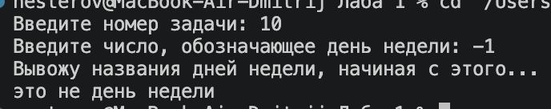

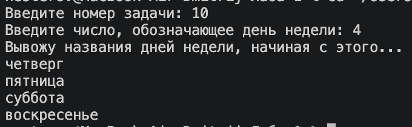


# Задание 3

## Задача 1

### Текст задачи

**Числа наоборот.**

Дана сигнатура функции: `String reverseListNums (int x);`

Необходимо реализовать функцию таким образом, чтобы она возвращала строку, в которой будут записаны все числа от x до 0 (включительно).

Пример:

```
x=5
результат: “5 4 3 2 1 0”
```

### Алгоритм решения

Создаём пустую строку. В цикле идём от заданного числа вниз до нуля и в каждом шаге добавляем число в строку. После каждого числа, кроме нуля, добавляем пробел.

### Тестирование

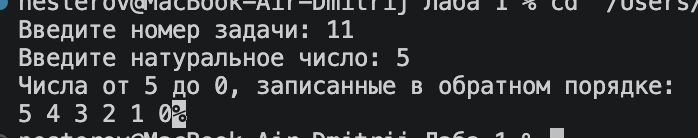

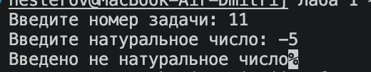

## Задача 2

### Текст задачи

**Степень числа.**

Дана сигнатура функции: `int pow (int x, int y);`

Необходимо реализовать функцию таким образом, чтобы она возвращала результат возведения x в степень y.

Подсказка: для получения степени необходимо умножить единицу на число x, и сделать это y раз, т.е. два в третьей степени это 1*2*2*2

Пример:

```
x=2
y=5
результат: 32
```

### Алгоритм решения

Берём результат равный единице. Повторяем столько раз, какова степень: умножаем результат на основание.

### Тестирование

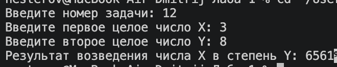

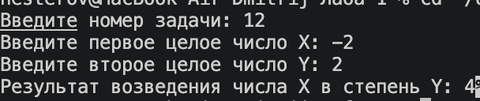

## Задача 3

### Текст задачи

**Одинаковость.**

Дана сигнатура функции: `bool equalNum (int x);`

Необходимо реализовать функцию таким образом, чтобы она возвращала true, если все знаки числа одинаковы, и false в ином случае.

Подсказки:

```
intx=123%10; // х будет иметь значение 3
intу=123/10; // у будет иметь значение 12
```

Пример 1:

```
x=1111
результат: true
```

Пример 2:

```
x=1211
результат: false
```

### Алгоритм решения

Берём число без знака и запоминаем его последнюю цифру. Пока число больше нуля, сравниваем его последнюю цифру с запомненной. Если они различаются, ответ «ложь». Затем отбрасываем последнюю цифру. Если дошли до нуля без различий, ответ «истина».

### Тестирование

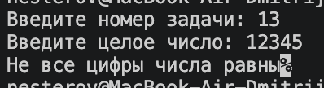

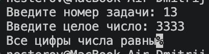

## Задача 4

### Текст задачи

**Левый треугольник.**

Дана сигнатура функции: `void leftTriangle (int x);`

Необходимо реализовать функцию таким образом, чтобы она выводила на экран треугольник из символов ‘*’ у которого х символов в высоту, а количество символов в ряду совпадает с номером строки.

Пример 1:

```
x=2
результат:
*
**
```

Пример 2:

```
x=4
результат:
*
**
***
****
```

### Алгоритм решения

Внешний цикл проходит по строкам от первой до заданной высоты. Во внутреннем цикле выводим звёздочки в количестве, равном номеру строки. После этого переходим на новую строку.

### Тестирование

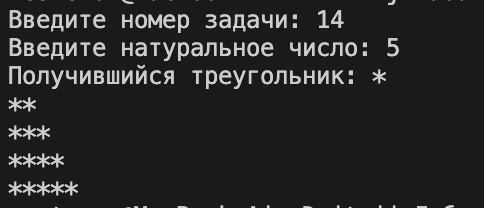

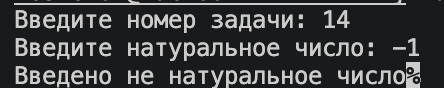

## Задача 5

### Текст задачи

**Угадайка.**

Дана сигнатура функции: `void guessGame()`

Необходимо реализовать функцию таким образом, чтобы она генерировала случайное число от 0 до 9, далее считывала с консоли введенное пользователем число и выводила, угадал ли пользователь то, что было загадано, или нет. Функция запускается до тех пор, пока пользователь не угадает число. После этого выведите на экран количество попыток, которое потребовалось пользователю, чтобы угадать число.

Пример:

```
Введите число от 0 до 9:
5
Вы не угадали, введите число от 0 до 9:
9
Вы угадали!
Вы отгадали число за 2 попытки
```

### Алгоритм решения

Загадываем случайное число от 0 до 9 и обнуляем счётчик попыток. В цикле запрашиваем число и увеличиваем счётчик. Если число не совпало с загаданным, сообщаем об ошибке и повторяем. Когда пользователь угадал, выводим поздравление и число попыток.

### Тестирование

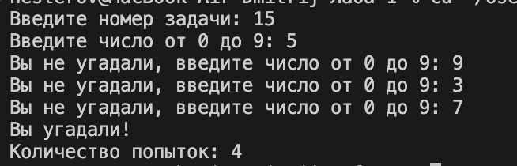

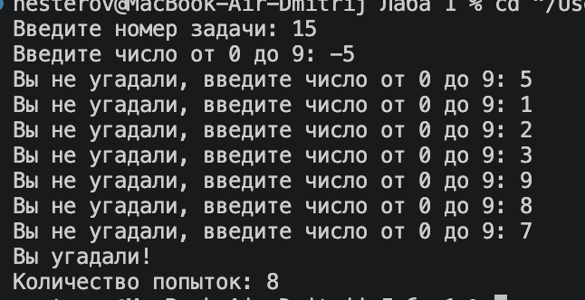
